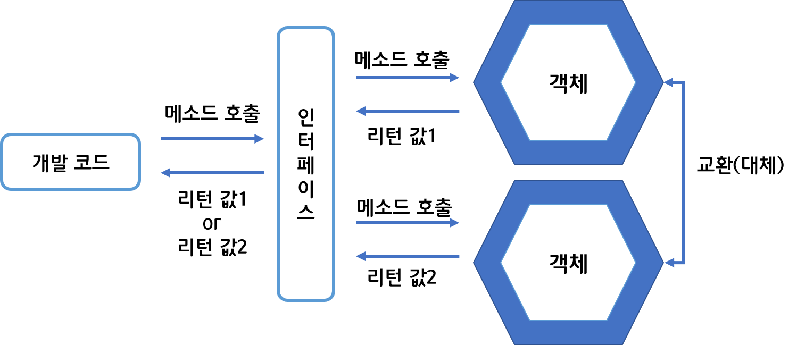

# Cp8. 인터페이스

## 인터페이스 역할

### 사전적 의미

- 두 장치를 연결하는 접속기
- 두 객체를 연결하는 역할을 한다.



- 객체가 다른 객체로 변경되더라도 개발코드의 변경이 필요없음.

→ 다형성

## 인터페이스와 구현 클래스 선언

### 인터페이스 선언

```java
interface 인터페이스명 {...}
public interface 인터페이스명 {
	//public 상수 필드
	//public 추상 메소드
	//public 디폴트 메소드
	//public 정적 메소드
	//private 메소드
	//private 정적 메소
}
```

### 구현클래스 선언

```java
public interface Parent {...}
public class Child implements Parent {...}
```

### 변수선언과 구현 객체 대입

- 다운캐스팅 사용하면 됨.

```java
Parent rc = new Child();
```

## 상수 필드

- 인터페이스는 public static final 특성을 갖는 불변의 상수필드를 멤버로 가진다.

```java
public interface RemoteControl {
	int MAX_VALUE = 10;
	int MIN_VALUE = 0;
}
// public static final을 생략하더라도 자동으로 붙어서 컴파일됨
```

## 추상 메소드

- 인터페이스는 구현 클래스가 재정의해야하는 public 추상 메소드를 멤버로 가질 수 있다.
- 리턴 타입, 메소드명, 매개변수만 기술된다.
- public abstract를 생략해도 컴파일시 자동으로 붙는다.
- 구현 클래스에서 반드시 오버라이딩을 통해 **실행코드**를 가져야 한다.
- 인터페이스로 구현 객체를 사용하려면 업캐스팅을 통해 사용한다.

## 디폴트 메소드

- 인터페이스에 완전한 실행 코드를 가진 디폴트 메소드를 선언할 수 있다.
- default 키워드가 리턴 타입 앞에 붙는다.

```java
public interface RemoteControl {
	int MAX_VALUE = 10;
	int MIN_VALUE = 0;
	
	void turnOn();
	void turnOff();
	void setVolume(int volume);
	
	default void setMute(boolean mute){
		if(mute){
			sout("무음처리합니다");
			setVolume(MIN_VOLUME);
		} else {
			sout("무음해제합니다");
		}
	}
}
```

- 디폴트 메소드는 구현 클래스만 대입하면 **구현클래스에서 재정의 하지 않아도 사용할 수 있다.**
- 구현 클래스에서 디폴트 메소드를 재정의 할 수도 있지만 **public 접근 제한자를 반드시 붙여야 하고 default 키워드를 생략해야 한다.**

## 정적 메소드

- 인터페이스에 선언 가능, 구현객체가 없어도 인터페이스만으로 호출 가능
- 클래스 정적 메소드와 같이 선언하면 된다. public 생략해도 컴파일과정에서 자동으로 붙음.

## private 메소드

- 인터페이스 내부에서 구현가능하다.
- 호출 시 디폴트 메소드를  통해 호출한다.
- private 정적 메소드는 디폴트 메소드, 정적 메소드로 호출 가능하다.

## 다중 인터페이스

- 구현 클래스는 여러개의 인터페이스를 implements할 수 있다.
- 구현 클래스는 implements한 인터페이스의 모든 추상 메소드를 재정의해야 한다.
- 구현 클래스가 어떤 인터페이스 변수에 대입되느냐에 따라 호출할 수 있는 추상메소드가 결정된다.

```java
RemoteControl a = new Smart();//RemoteControl의 추상메소드만 호출 가능
Searchable b = new Smart();//Searchable의 추상메소드만 호출 가능
```

## 인터페이스 상속

- 인터페이스도 다른 인터페이스를 상속할 수 있고, 다중 상속을 허용한다.

```java
public interface Child extends Parent1, Parent2 { ... }
```

- 자식 인터페이스의 구현 클래스는 부모/자식 인터페이스의 모든 추상메소드를 재정의해야한다.
- 똑같이 업캐스팅/다운캐스팅에 따라 사용가능한 메소드가 다르다.

## 타입 변환

- 상속의 업캐스팅/다운캐스팅과 같아서 생략

## 다형성

- 현업에서는 상속보다 인터페이스를 통해서 다형성을 구현하는 경우가 더 많다.

→다형성의 예시

메소드 재정의 + 자동 타입 변환(업캐스팅) → 다형성

### 필드의 다형성

- 필드 타입으로 인터페이스를 선언하면 자동 타입 변환을 통해 다형성 구현

```java
public Class Car{
	Tire tire1 = new KoreaTire();
	Tire tire2 = new JapanTire();
}
```

### 매개변수의 다형성

- 매개변수 타입을 부모 타입으로 선언하고 호출할 때에는 다양한 자식 객체를 대입한다.

→ 자동 타입 변환을 통해 구현객체 대입 → 다형성 구현

```java
public class Driver {
	void drive(Vehicle vehicle){ vehicle.run(); }
}
Driver driver = new Driver();
Bus bus = new Bus();
Truck truck = new Truck();

driver.drive(bus);
driver.drive(truck);
```

## 객체 타입 확인

- instanceof (상속과 같으므로 생략)

## 봉인된 인터페이스

- sealed, non-sealed

```java
public sealed interface A permits B {...}
//A의 자식인터페이스는 B만 가능
public non-sealed interface B extends A { ... }
//B는 다른 자식 인터페이스를 만들 수 있다.(봉인해제)
```